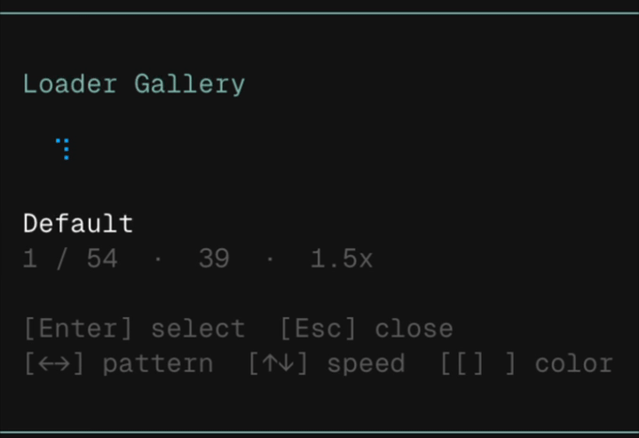

# pi-loader ⠿

**Braille-dot working indicator for pi coding agent.**

Replaces the default spinner with rich 2-character braille animations. 54+ patterns including helixes, neural flickers, sweeps, snakes, and more — all in pure ASCII-compatible Unicode braille.




> *Demo: preview gallery, pattern switching, speed & color controls*

## Installation

### Via pi (recommended)

```bash
pi install git:github.com/graedenn/pi-loader
```

Then `/reload` or restart pi.

### Manual

```bash
mkdir -p ~/.pi/agent/extensions/pi-loader
cp index.ts patterns.ts ~/.pi/agent/extensions/pi-loader/
/reload
```

## Usage

| Command | Description |
|---|---|
| `/loader pattern <name>` | Switch animation pattern |
| `/loader color <color>` | Set color (name, `#hex`, or `0-255` ANSI) |
| `/loader speed <n>` | Set speed multiplier (0.25–10.0) |
| `/loader preview` | Interactive gallery with live preview |
| `/loader reset` | Restore defaults |
| `/loader off` / `on` | Disable / re-enable |

### Preview mode

`/loader preview` opens an interactive picker:

| Key | Action |
|---|---|
| `←` `→` | Switch pattern |
| `↑` `↓` | Adjust speed |
| `[` `]` | Cycle color |
| `Enter` | Select and apply |
| `Esc` | Close |

Named colors: `accent`, `muted`, `dim`, `text`, `success`, `warning`, `error`, `border`, `borderAccent`

## All Patterns

<details>
<summary>Click to expand (54+ patterns)</summary>

| Key | Name | Frames |
|---|---|---|
| `default` | Default | 10 |
| `single-dots` | Single Dots | 8 |
| `single-bounce` | Single Bounce | 14 |
| `single-fill` | Single Fill | 14 |
| `single-sweep` | Single Sweep | 8 |
| `half-helix` | Half Helix | 16 |
| `helix-core` | Helix Core | 12 |
| `helix-glow` | Helix Glow | 20 |
| `thought-helix` | Thought Helix | 19 |
| `pulse-ladder` | Pulse Ladder | 16 |
| `core-spiral` | Core Spiral | 16 |
| `twin-orbit` | Twin Orbit | 16 |
| `infinity-run` | Infinity Run | 20 |
| `radar-arc` | Radar Arc | 20 |
| `scan` | Scan | 6 |
| `sweep` | Sweep | 13 |
| `agent-sweep` | Agent Sweep | 19 |
| `sound-bars` | Sound Bars | 16 |
| `perimeter-spin-light` | Perimeter Spin Light | 12 |
| `perimeter-spin` | Perimeter Spin | 12 |
| `perimeter-spin-bold` | Perimeter Spin Bold | 12 |
| `shuffle` | Shuffle | 7 |
| `hangtime` | Hangtime | 57 |
| `line-spin` | Line Spin | 8 |
| `ray-spin` | Ray Spin | 8 |
| `rotating-x` | Rotating X | 4 |
| `texture-flip` | Texture Flip | 2 |
| `neural-flicker` | Neural Flicker | 15 |
| `neural-flicker-chaos` | Neural Flicker Chaos | 43 |
| `neural-flicker-drift` | Neural Flicker Drift | 41 |
| `neural-flicker-thought` | Neural Flicker Thought | 41 |
| `neural-scatter` | Neural Scatter | 16 |
| `neural-spike` | Neural Spike | 14 |
| `neural-random-walk` | Neural Random Walk | 16 |
| `neural-cross-spark` | Neural Cross Spark | 14 |
| `neural-offset` | Neural Offset | 14 |
| `neural-braid` | Neural Braid | 18 |
| `thinking-pulse` | Thinking Pulse | 21 |
| `soft-thinking` | Soft Thinking | 16 |
| `deep-thought` | Deep Thought | 23 |
| `signal-search` | Signal Search | 15 |
| `binary-thought` | Binary Thought | 13 |
| `center-spark` | Center Spark | 12 |
| `synapse-wave` | Synapse Wave | 20 |
| `inner-current` | Inner Current | 13 |
| `bouncing-block` | Bouncing Block | 12 |
| `face` | Smiley Face | 6 |
| `snake-crawl` | Snake Crawl | 30 |
| `snake-loop` | Snake Loop | 24 |
| `circle` | Circle | 6 |
| `square` | Square | 2 |
| `twinkle` | Twinkle | 2 |
| `corners` | Corners | 4 |
| `growth` | Growth | 10 |

</details>

## Adding Patterns

Add new patterns in `patterns.ts` as `type: "raw"` entries. Each frame is 1–2 braille characters. Use `braille-chars.txt` as a reference for encoding.

```ts
"my-pattern": {
  type: "raw",
  name: "My Pattern",
  frames: ["⠋⠙", "⠹⠸", "⠼⠴"],
  defaultSpeed: 1.0
}
```

## License

MIT
